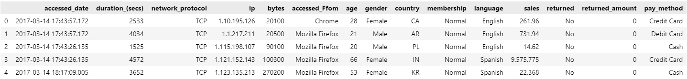

# AI Academy Capstone Project Team 2
## Repo Contents
* Download the dataset from [here](https://www.kaggle.com/datasets/willianoliveiragibin/websites-e-comerce) and place it in the folder with this readme.
* [Capstone Proposal.pdf](https://github.com/s-callejo/AI-Academy-capstone-project-team2/blob/main/Capstone%20Proposal.pdf) - File containing capstone proposal details
* [README.md](https://github.com/s-callejo/AI-Academy-capstone-project-team2/blob/main/README.md) - A description of the project goals, process, and results
* [eda.ipynb](https://github.com/s-callejo/AI-Academy-capstone-project-team2/blob/main/eda.ipynb) - Jupyter Notebook containing Exploratory Data analysis
* [index.ipynb](https://github.com/s-callejo/AI-Academy-capstone-project-team2/blob/main/index.ipynb) - Main Jupyter Notebook containing the models and anaylisis for the project

## Required Packages
* pandas
* sklearn
* imblearn
* collections
* matplotlib
* seaborn

In the case of imblearn package not working, reinstall sklearn and imblearn using the commands bellow.
> pip uninstall scikit-learn --yes  
> pip uninstall imblearn --yes  
> pip install scikit-learn==1.2.2  
> pip install imblearn

## Goal

In the dynamic realm of e-commerce, this project aims to address a critical challenge that is understanding the factors that drive customer returns, with a focus on enhancing profitability. Conventional approaches focus on maximizing sales, but our unique proposition is to unravel the complexities of dissatisfaction leading to product returns. By analyzing the feature importance within the dataset, we intend to provide actionable recommendations for businesses to minimize returns, thereby fostering relationships with customers. 

## Data

The raw dataset has 172838 entries with 15 columns that include: 'accessed_date', 'duration_(secs)', 'network_protocol', 'ip', 'bytes', 'accessed_Ffom', 'age', 'gender', 'country', 'membership', 'language','sales', 'returned_amount', 'pay_method' with target variable being 'returned'. This dataset was taken from the time frame of a week.

## Data Pre-Processing and Exploration

### Age and Gender
When looking into the age column, we saw that there were placeholder values that represented null items. For some reason there were 0s and  dashed lines. However, almost 50% of our data consists of these placeholder values which makes it difficult on deciding what to do with these values. We decided on just removing the those values as it was a way not to skew the data because replacing the mean, median, or mode in those values would just make an our model more biased to that value in the age feature. Additionally, since we still have a decent amount of data to use even after removing those data points, we will tset with the data that was left over and if the metrics point to having a better model with more data point then we may return to these data points and add them in. Furthermore, when researching with this column, we also learned that any unknown genders/ place holder values for the gender column was removed whenever we removed all the unknown ages. Since we are working with the data set without the unknown ages, we can skip identifying any unknown values in the gender column.

### Payment Methods
We have 4 payment methods. No need to deal with null, duplicates, or outliers

### Membership Type
When the 0s and null value Age rows were removed, the Not Logged In membership class is removed, leaving only the normal and premium classes for the model. No need to deal with null, duplicates, or outliers.

### Languages
There are 29 different languages used on the e-commerce site. The top 3 most common were English Chinese and Spanish. The format is not consistent across our data so we will capitalize the first letter of each language to provide consistency. There are no null values to address or any outliers.

### Access Methods
There are 7 different access methods found in the database; Android App, Chrome, Mozilla Firefox, iOS App, Safari, Microsoft Edge and Others. SafFRi is a misspelling of Safari and will be fixed before modeling. There are no null values to address or any outliers.

### Countries
There are 27 countries, all displayed as country codes, that users accessed the e-commerce site from. The top 3 were Italy, United States and Canada. No need to deal with null, duplicates, or outliers

### Return (Target Variable)
The thing that needs to be addressed with the target variable is the idea of an unbalanced data set. There is only about 15% of the data that contains customers that returned an item. Therefore, we need to test with different sampling techniques (under/over) to gte the dataset more balanced to have a better outcome with the metrics of modeling.

## Data After Pre-Processing

## Oversampling, Undersampling and SMOTE

As mentioned earlier the target variable in our dataset is imbalanced. This brings a few problems; possibility of bias toward the majority class, resulting in poor performance on the minority class, metrics such as accuracy can be misleading as high accuracy can be achieved by predicting the majority class, and the model may focus more on features that help distinguish the majority class, neglecting features important for minority class prediction.

To resolve this problem we used Oversampling/Undersampling and SMOTE. Oversampling duplicates the minority class until there are an equal number of records in the minority class as majority class. Undersampling takes pieces of the majority class to reduce the used portion of the majority class to have the same number of records as the minority class. SMOTE generates new records in the minority class to increase the number of records to equal the number in the majority class.

## Modeling

In this project we used Logistic Regression and Random Forest models. We conducted a grid search of hyperparameters to tune basic models of each in an attempt to achieve better models.

For logistic regression, we decided to change the solver and C (penalty strength) hyperparameters. With how our baseline model of logistic regression was performing, we needed to edit highly impactful hyperparameters to change how the logistic regression model was learning. One step was to change the solver. The solver is the type of algorithm used for optimization. The thought behind changing the solver was to see if the model could find a different way optimize the data, then maybe it could give us better accuracy. In addition to the solver, the C hyperparameter was also changed for overfitting reasons. It controls the strength of regularization in which it could make the model either simple or complex.

For random forest, the hyperparameters max_depth, and n_estimators help limit overfitting of a model. They both have a type of cutoff point wherein the model will stop training at where we set the cutoff point and then it stops the model from training too much which would cause overfitting. As we can see with our accuracy scores, the model tend to overfit in the training data so it seems best to edit these hyperparameters to try and get a better model.

## Results

For logistic regression, changing the hyperparameters made the oversampled set of training data have almost no change in accuracy rate (from .54 to .5405 for training and .3988 to .3988 for test). As for the under sample, there were only slight improvements (from .5389 to .5434 for the training and from .401 to .4026 for the test). For the SMOTE oversampling method, the change made the model slightly better for the training and the testing.

For random forest, the hyperparameters found by grid search made the model performance worse on the unseen data. When using the over sampled set, the training accuracy went from .9586 to .9494 and the test accuracy went from .742 to .726. When using the under sampled set, the training accuracy went from .9616 to .6265 and the test accuracy went from .5149 to .3744. For the SMOTE oversampling, the same can be seen in which the model become worse when the new hyperparameters are applied.

In the ROC curve, we can see that the training is overfitting and the test set is only ever so slightly better than random chance.

In the confusion matrix, it can contribute to the idea the model is being biased to predicting non-returned items as proposed by our imblanced data problem.

The precion and recall table also contrinbutes to this idea as the proportions of predicting 0 (non-returned) as better than 1 (returned)

